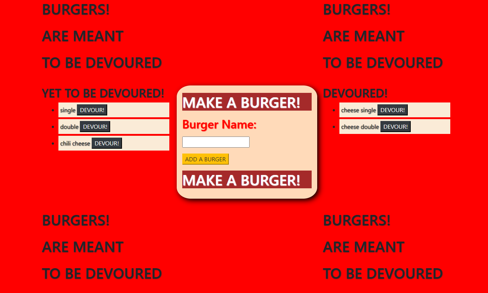

# UNIT 13 eat-da-burgers

What does MySQL, Node, Express, Handlebars, ORM, MVC design pattern, Node, Heroku Deployment, JAWSDB & brutalist design have in common?

THIS BURGER APPLICATION!

## Overview

This project was a gentle step into full stack development where through click events, an old and reliable database system (looking at you MYSQL!), and some solid packages I launched my second full stack application. While this project was limited in scope, it definitely allowed me to zoom out a bit in the process & better conceptualize how to build better and stronger applications in the future.

As usual, I created a process document to get me started and have a wider scope of what is going on in the assignment & better understand how I can move forward in a clear process oriented development.

## What is a Full Stack Developer

A full stack developer is a person that can deploy both client & server software. 

This project is another step in my development to being a full stack developer & deploying more and more sites that have full client & server interconnectivity & function that I have built myself. From the outside, a simple click event with things moving from one side of the page to another may seem trivial, but what it accurately represents is A MAJOR SHIFT from client to server and back to the client in a new position told through a playful burger application.

## Considerations

JAWSDB and linking Heroku, this is what brought the full stack application to life, and while they are free & definitely have their quirks. They work & can accurately display changes in the system based on user input. 